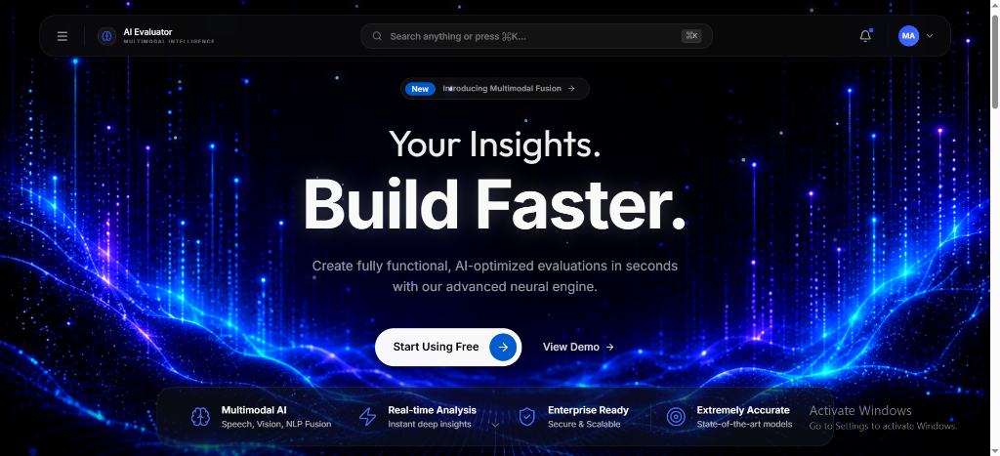
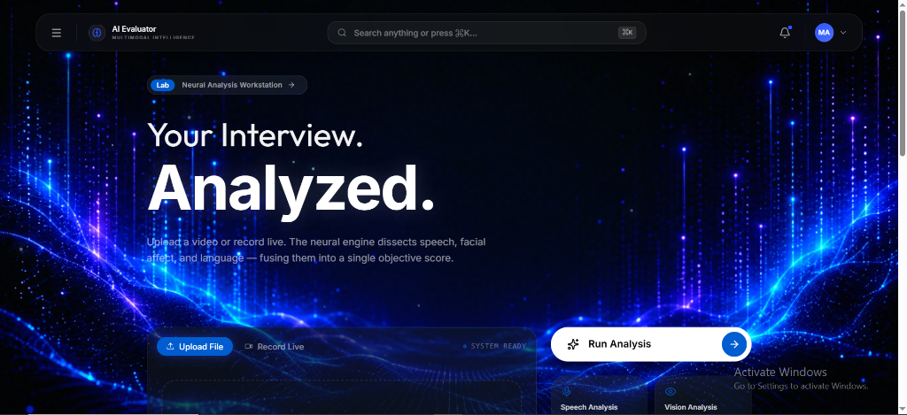
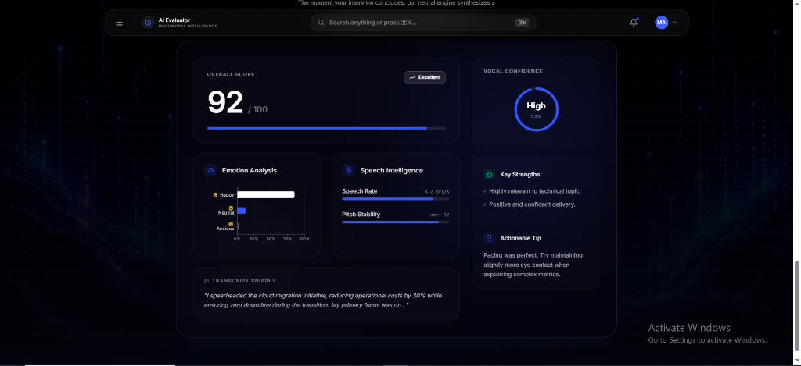
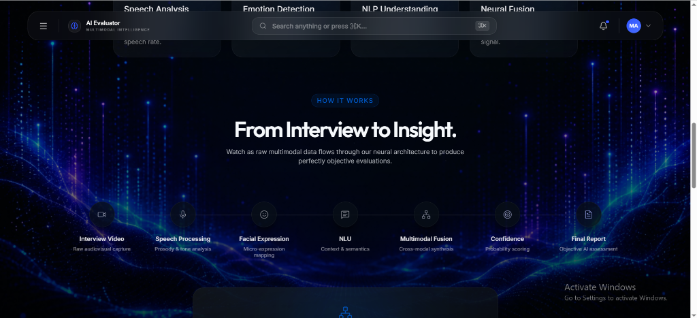
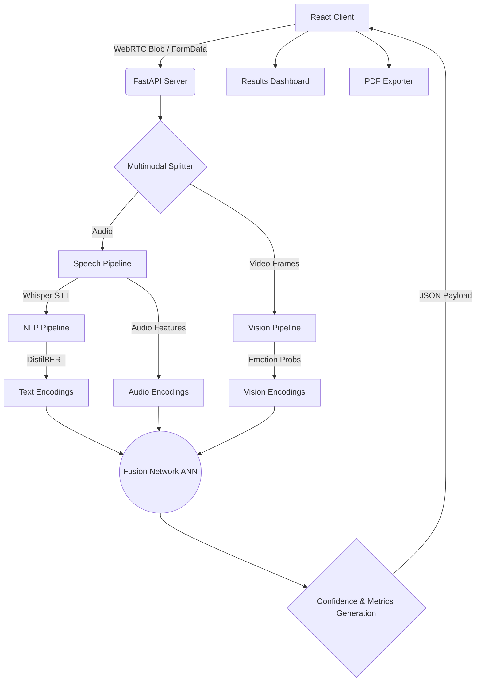

<div align="center">

# 🧠 Multimodal AI Interview Evaluator

**Enterprise-grade AI for real-time interview performance analysis.**

[](https://opensource.org/licenses/MIT)
[](https://www.python.org/)
[](https://react.dev/)
[](https://fastapi.tiangolo.com/)
[](https://pytorch.org/)
[](https://www.typescriptlang.org/)
[](https://github.com/placeholder/repository)
[](https://github.com/placeholder/repository/issues)

</div>

---

## Table of Contents

- [Hero Section](#hero-section)
- [Screenshots](#screenshots)
- [Demo](#demo)
- [Features](#features)
- [Technology Stack](#technology-stack)
- [System Architecture](#system-architecture)
- [Project Structure](#project-structure)
- [AI Pipeline](#ai-pipeline)
- [User Workflow](#user-workflow)
- [Installation](#installation)
- [Environment Variables](#environment-variables)
- [Usage](#usage)
- [API Documentation](#api-documentation)
- [Screens Explained](#screens-explained)
- [Design Philosophy](#design-philosophy)
- [Performance](#performance)
- [Security](#security)
- [Future Improvements](#future-improvements)
- [Contributing](#contributing)
- [License](#license)
- [Acknowledgements](#acknowledgements)
- [Contact](#contact)
- [Repository Statistics](#repository-statistics)

---

## Hero Section

The **Multimodal AI Interview Evaluator** is a cutting-edge web application designed to analyze a candidate's speech, facial expressions, and semantic context simultaneously to provide real-time, actionable interview feedback. 

**Who it is for:**
- **Job Candidates:** Seeking to refine their interview mechanics (eye contact, pacing, emotional tone, and structured answering).
- **Recruiters & Hiring Managers:** Looking for quantitative metrics to augment the subjective interview process.
- **Career Coaches:** Needing a scalable tool to evaluate and track their clients' progress over time.

**What problem it solves:**
Traditional interview feedback is highly subjective, prone to unconscious bias, and rarely quantitative. By fusing computer vision (emotion detection), speech-to-text, and natural language processing, this platform provides an objective, repeatable score of a candidate's performance. 

**Why it is interesting:**
Instead of relying on a single modality (like text alone), it implements a **Multimodal Fusion ANN**, accurately mapping the complex interplay between *what* you say, *how* you say it, and what your face looks like while saying it.

---

## Screenshots

| Landing Page | Analysis Page |
|:---:|:---:|
|  <br> *High-converting hero section with dynamic background glows.* |  <br> *WebRTC camera capture with animated processing state.* |

| Results Dashboard | Architecture Diagram |
|:---:|:---:|
|  <br> *Data visualization including Radar, Bar charts, and Confidence Rings.* |  <br> *System architecture showcasing pipeline flow.* |

### Demo GIF

*End-to-end user flow from recording to generating the PDF report.*

---

## Demo

- **Live Demo:** [Placeholder Link](https://example.com)
- **Video Demo:** [Placeholder Link](https://youtube.com)
- **Documentation:** [Placeholder Link](https://example.com/docs)
- **Presentation Deck:** [Placeholder Link](https://example.com/pitch)

---

## Features

| Feature | Description | Status |
|---|---|:---:|
| **Speech Analysis** | Analyzes cadence, filler words, and vocal confidence. | 🟢 |
| **Facial Emotion Recognition** | Real-time analysis of micro-expressions and general affect. | 🟢 |
| **Natural Language Processing** | Transcribes audio and evaluates sentiment, context, and structure. | 🟢 |
| **Multimodal Fusion** | Merges Speech, Vision, and NLP data streams into a single vector. | 🟢 |
| **Interactive Dashboard** | Rich data visualizations (Recharts) summarizing performance metrics. | 🟢 |
| **Real-Time Processing** | Immediate feedback via high-performance FastAPI backends. | 🟢 |
| **Responsive UI** | Mobile-first architecture built with Tailwind CSS v4. | 🟢 |
| **PDF Reporting** | Client-side generation of professional performance reports (`jsPDF`). | 🟢 |

---

## Technology Stack

<details>
<summary><b>Frontend</b></summary>

| Technology | Purpose |
|---|---|
| **React 19** | Core UI library |
| **TanStack Start (Vite)** | Framework, routing, and bundling |
| **Tailwind CSS v4** | Utility-first styling |
| **Framer Motion** | GPU-accelerated micro-animations |
| **Recharts** | Interactive data visualization |
| **Lucide React** | Consistent vector iconography |
| **jsPDF / autoTable** | Client-side PDF report generation |

</details>

<details>
<summary><b>Backend & Machine Learning</b></summary>

| Technology | Purpose |
|---|---|
| **FastAPI** | High-performance async API server |
| **PyTorch** | Deep learning framework for neural networks |
| **OpenAI Whisper** | Robust speech-to-text transcription |
| **DistilBERT** | Efficient NLP for sentiment and context analysis |
| **OpenCV** | Computer vision and facial detection utilities |
| **Scikit-Learn** | Data scaling and traditional ML utilities |

</details>

---

## System Architecture

The application is structured as a decoupled React Single Page Application communicating with a Python inference server.



---

## Project Structure

```text
├── backend/                  # Python/FastAPI Backend Services
│   ├── api.py                # Main FastAPI router
│   ├── models/               # PyTorch model definitions
│   ├── pipeline/             # Audio, Vision, and NLP processing scripts
│   └── weights/              # Pre-trained model weights (Ignored in Git)
├── src/                      # Frontend Application (TanStack/React)
│   ├── components/           # Reusable UI components (React)
│   ├── hooks/                # Custom React hooks (e.g., use-analysis.ts)
│   ├── lib/                  # Utilities (Tailwind merge, styling helpers)
│   └── routes/               # Page routing components
├── public/                   # Static assets
└── package.json              # Node dependencies
```

---

## AI Pipeline

The system processes incoming video files via a sophisticated multi-stage pipeline:

1. **Speech Processing:** The audio track is isolated. **Whisper** transcodes the audio to text while secondary systems extract acoustic features (pitch, speed, pauses).
2. **Vision Pipeline:** Frames are sampled from the video. A convolutional network detects faces and classifies emotions (Happy, Neutral, Anxious, etc.) over time.
3. **NLP Pipeline:** The transcript is passed through **DistilBERT** to gauge sentiment and semantic relevance.
4. **Fusion ANN:** The extracted feature vectors from Vision, Speech, and NLP are concatenated. A PyTorch Artificial Neural Network (ANN) processes this dense vector to calculate the final aggregate confidence and performance scores.

---

## User Workflow

1. **Landing:** User arrives at the high-converting landing page.
2. **Upload/Record:** User navigates to `/analyze` to record a video via WebRTC or upload a pre-recorded `.mp4`.
3. **Processing:** Video is sent to the backend; UI enters an animated loading state.
4. **Analysis:** Backend executes the AI Pipeline (Vision, NLP, Speech).
5. **Results:** Backend returns JSON; the app routes to `/results` to populate the dashboard.
6. **Report:** User clicks "Download Report" to save a vector-based PDF.

---

## Installation

### Prerequisites
- Node.js (v18+)
- Python (3.10+)
- Virtualenv
- FFmpeg (Required for OpenAI Whisper and OpenCV video processing)

### 1. Clone the Repository
```bash
git clone https://github.com/placeholder/repository.git
cd repository
```

### 2. Backend Setup
```bash
cd backend
python -m venv venv

# Windows
venv\Scripts\activate
# macOS/Linux
source venv/bin/activate

pip install -r requirements.txt
```

### 3. Frontend Setup
```bash
# Return to the project root
cd ..
npm install
```

### 4. Environment Variables
Create a `.env` file in the root directory (or use the provided `.env.example`):
```env
VITE_API_BASE_URL=http://127.0.0.1:8000/api
MODEL_WEIGHTS_PATH=./backend/weights/
```

### 5. Run Development Servers
**Terminal 1 (Backend):**
```bash
cd backend
# Ensure virtual environment is activated
python start_server.py
# Server runs on http://127.0.0.1:8000
```

**Terminal 2 (Frontend):**
```bash
npm run dev
# Client runs on http://localhost:5173
```

### 6. Production Build
```bash
npm run build
# The optimized bundle will be generated in the /dist folder
```

---

## Environment Variables

> [!IMPORTANT]
> A `.env` file must be created to configure the application.

| Variable | Description | Default / Example |
|---|---|---|
| `VITE_API_BASE_URL` | Base URL for the FastAPI backend. | `http://127.0.0.1:8000/api` |
| `MODEL_WEIGHTS_PATH` | Absolute/relative path to PyTorch weights. | `./backend/weights/` |

---

## Usage

1. Open the application in your browser (`http://localhost:5173`).
2. Click **Start Analysis**.
3. Allow camera/microphone permissions when prompted.
4. Record yourself answering a behavioral interview question (e.g., *"Tell me about yourself"*). Aim for 30-60 seconds for optimal results.
5. Click **Submit**. Wait for the AI processing to complete.
6. Review your Confidence Score, Emotion Breakdown, and Speech Metrics.
7. Click **Download Report** to save a PDF copy for your records.

---

## API Documentation

### `POST /api/analyze`

Accepts a multipart form data submission containing a video file and processes it through the Multimodal AI Pipeline.

**Request:**
- `Content-Type: multipart/form-data`
- `file`: `Blob` or `File` (.mp4, .webm)

**Success Response (200 OK):**
```json
{
  "status": "success",
  "confidence_score": 87.5,
  "metrics": {
    "speech": {
      "wpm": 135,
      "filler_words": 2
    },
    "emotion": {
      "neutral": 0.60,
      "happy": 0.30,
      "anxious": 0.10
    },
    "nlp": {
      "sentiment": 0.8,
      "relevance": 0.9
    }
  },
  "transcript": "I am a software engineer..."
}
```

**Error Response (400 / 500):**
```json
{
  "status": "error",
  "message": "Invalid file format. Please upload a valid video."
}
```

---

## Screens Explained

The Results Dashboard (`/results`) is the core value proposition of the app, translating complex tensor data into human-readable metrics:

- **Confidence Score:** A weighted, aggregate percentage generated by the final layer of the Fusion ANN.
- **Emotion Bar Chart:** Displays the distribution of dominant facial expressions during the recording.
- **Speech Metrics:** Shows Words Per Minute (WPM), pause durations, and filler word counts.
- **Sentiment & Relevance:** Evaluated by DistilBERT to ensure the spoken words actually answer a professional prompt cleanly.
- **Multimodal Fusion Radar:** A radar chart mapping the balance between the three core pillars (Vision, Speech, NLP). A highly balanced candidate will have a large, symmetric polygon.

---

## Design Philosophy

- **Neural Command Center Aesthetic:** The UI is designed to feel like an enterprise-grade AI terminal. It utilizes deep dark modes, neon blue accents, and high-contrast text.
- **Glassmorphism:** Strategic use of `backdrop-blur` and semi-transparent surfaces creates depth without visual clutter.
- **Fluid Micro-Animations:** Driven by Framer Motion, every interaction—from route transitions to chart rendering—is GPU-accelerated and smooth.
- **Typography:** `Outfit` is used for display headers to provide a futuristic edge, while `Inter` ensures maximum legibility for body text and data tables.
- **Accessibility:** High-contrast ratios and fully navigable command palettes ensure the platform is usable by all candidates.

---

## Performance

- **Frontend Optimization:** Heavy use of React Server Components (where applicable via TanStack), lazy loading for routes, and memoization (`useMemo`, `useCallback`) to prevent chart re-renders.
- **Animation Efficiency:** All Framer Motion animations use transform and opacity properties exclusively to avoid main-thread layout thrashing.
- **Backend Concurrency:** FastAPI leverages Python's `asyncio` for non-blocking I/O during file uploads, while PyTorch inference is batched where appropriate to maximize hardware utilization.

---

## Security

> [!WARNING]
> This application handles sensitive biometric data (facial imagery, voice). 

- **Ephemeral Processing:** Uploaded videos are saved as temporary files on the backend and are securely deleted immediately after inference is complete.
- **Input Validation:** The backend strictly validates MIME types and file sizes before allocating processing memory.
- **Client-Side Generation:** PDF reports are generated entirely in the browser using `jsPDF`. No user reports are stored on the server.

---

## Future Improvements

- [ ] **Live Interview Mode:** Implement WebSockets for real-time, streaming feedback during a live interview.
- [ ] **LLM Feedback Generation:** Integrate an LLM (e.g., GPT-4o, Claude 3.5 Sonnet) to generate conversational text feedback based on the pipeline's JSON metrics.
- [ ] **Database Integration:** Connect PostgreSQL/Prisma to allow users to create accounts and track their historical performance over time.
- [ ] **Authentication:** Implement NextAuth or Clerk for secure user sessions.
- [ ] **Cloud Deployment:** Containerize the backend with Docker for deployment to AWS ECS or Google Cloud Run.

---

## Contributing

We welcome professional contributions. Please follow our guidelines:

1. **Fork** the repository.
2. **Create a branch:** `git checkout -b feature/your-feature-name` or `fix/your-bug-fix`.
3. **Commit your changes:** Adhere to [Conventional Commits](https://www.conventionalcommits.org/en/v1.0.0/).
4. **Push to the branch:** `git push origin feature/your-feature-name`.
5. **Open a Pull Request** against the `main` branch.

All PRs must pass the existing TypeScript compilation step (`tsc --noEmit`) and not introduce any regressions in the UI.

---

## License

This project is licensed under the MIT License - see the [LICENSE](LICENSE) file for details. *(Placeholder)*

---

## Acknowledgements

- Built with [React](https://react.dev/) & [FastAPI](https://fastapi.tiangolo.com/)
- Machine Learning powered by [PyTorch](https://pytorch.org/), [OpenAI Whisper](https://github.com/openai/whisper), and [Hugging Face](https://huggingface.co/)
- UI animated via [Framer Motion](https://www.framer.com/motion/)
- Charts by [Recharts](https://recharts.org/)
- Inspiration drawn from the open-source AI community.

---

## Contact

- **LinkedIn:** [Placeholder](www.linkedin.com/in/muhammad-abbas-6a9374295)
- **Email:** `[abbasmohammad812@gmail.com]`

---


