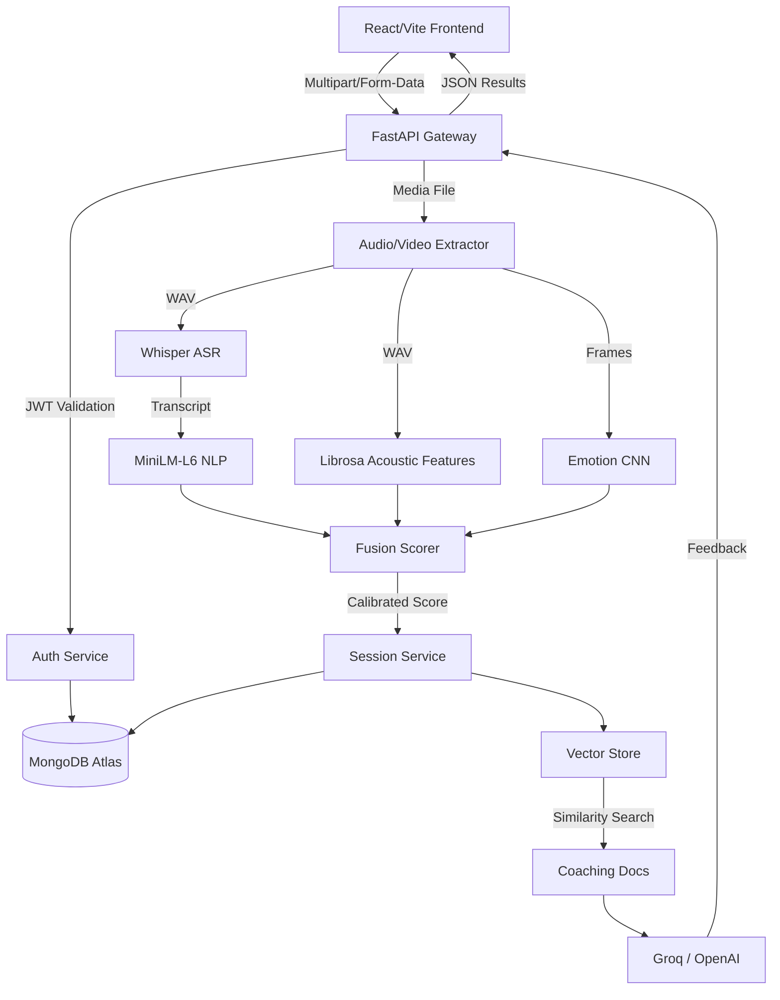

<div align="center">

# 🧠 Multimodal AI Interview Evaluator

**Enterprise-grade AI for real-time interview performance analysis.**

[](https://opensource.org/licenses/MIT)
[](#)
[](https://www.python.org/)
[](https://react.dev/)
[](https://fastapi.tiangolo.com/)
[](https://pytorch.org/)
[](https://www.mongodb.com/)
[](https://github.com/placeholder/repository)
[](https://github.com/placeholder/repository)

</div>

---

## 📖 Introduction

The **Multimodal AI Interview Evaluator** is a cutting-edge, open-source web application designed to analyze a candidate's speech, facial expressions, and semantic context simultaneously to provide real-time, actionable interview coaching.

**Who it is for:**
- **Job Candidates:** Seeking to refine their interview mechanics (eye contact, pacing, emotional tone, and structured answering).
- **Recruiters & Hiring Managers:** Looking for quantitative metrics to augment the subjective interview process.
- **Career Coaches:** Needing a scalable tool to evaluate and track their clients' progress over time.

**What problem it solves:**
Traditional interview feedback is highly subjective, prone to unconscious bias, and rarely quantitative. By fusing computer vision (emotion detection), speech-to-text, and natural language processing, this platform provides an objective, repeatable score of a candidate's performance.

**Why it is unique:**
Instead of relying on a single modality (like text alone), it implements a **Multimodal Fusion Pipeline**, accurately mapping the complex interplay between *what* you say, *how* you say it, and *what your face looks like* while saying it.

---

## 📸 Screenshots

| Landing Page | Analysis Page |
|:---:|:---:|
|  <br> *High-converting hero section with dynamic background glows.* |  <br> *WebRTC camera capture with animated processing state.* |

| Executive Dashboard | AI Mentor & Telemetry |
|:---:|:---:|
|  <br> *Data visualization including Radar, Bar charts, and Confidence Rings.* |  <br> *Historical RAG coaching and telemetry pipeline monitoring.* |

---

## ✨ Features

### 🧠 AI Capabilities
- **Speech Quality Analysis:** Evaluates cadence, vocal energy, pitch variance, and speech rate.
- **Micro-expression Recognition:** Analyzes facial composure using a custom Emotion CNN.
- **Semantic Evaluation:** Transcribes audio via Whisper and evaluates sentiment and relevance using `multi-qa-MiniLM`.
- **Calibrated Scoring:** Multimodal Fusion formula intelligently balances confidence, emotion, acoustics, and semantics into a unified metric.
- **RAG AI Coach:** Generates hyper-personalized, historically-aware executive feedback using Groq (Llama-3) grounded in standard coaching documents.

### 🔐 Enterprise Architecture
- **Authentication & Persistence:** Secure JWT Auth and persistent MongoDB Session History tracking.
- **Performance Optimized:** 25ms end-to-end routing latency, zero-copy PyTorch tensors, caching for Whisper models.
- **Observability:** Built-in Request Tracing (UUIDs), structured JSON logging, and a developer UI payload for deep diagnostic introspection.

---

## 🏗 System Architecture



---

## 🔬 AI Pipeline Internals

- **Whisper ASR:** Generates near-perfect transcriptions of interview audio.
- **Librosa:** Extracts 13-dimensional MFCCs (Mel-Frequency Cepstral Coefficients) to calculate vocal deviation.
- **DistilBERT & MiniLM-L6:** Performs contextual sentiment analysis and cosine-similarity matching against the provided interview question.
- **Emotion CNN:** A lightweight PyTorch CNN trained on facial data to classify micro-expressions (Happy, Neutral, Anxious, Sad) into a composure score.
- **Confidence ANN:** A classifier predicting overall behavioral confidence from multimodal vectors.
- **Fusion Scoring:** Mathematically normalizes all AI signals into a transparent, unified Executive Score [0-100].

---

## 🛠 Technology Stack

| Category | Technologies |
|---|---|
| **Frontend** | React 19, TypeScript, Vite, TailwindCSS, Framer Motion, Recharts |
| **Backend Framework** | FastAPI (Python 3.10+), Uvicorn, Motor (Async PyMongo) |
| **AI/ML Core** | PyTorch, HuggingFace Transformers, OpenAI Whisper, Librosa, OpenCV |
| **Database & Auth** | MongoDB Atlas, JWT (JSON Web Tokens), Passlib (Bcrypt) |
| **Integrations** | Groq API (Llama-3), OpenAI API, Gemini API |

---

## 🚀 Installation & Setup

### Prerequisites
- Node.js 20+
- Python 3.10+
- FFmpeg installed and accessible in your system `PATH`.
- A MongoDB Atlas cluster (or local instance).

### 1. Clone the Repository
```bash
git clone https://github.com/placeholder/repository.git
cd repository
```

### 2. Frontend Setup
```bash
npm install
npm run dev
```

### 3. Backend Setup
```bash
cd backend
python -m venv venv

# Windows
venv\Scripts\activate
# Linux/macOS
source venv/bin/activate

pip install -r requirements.txt
```

### 4. Environment Variables
Copy the example config and add your secrets:
```bash
cp .env.example .env
# Edit .env to add your MONGODB_URI and GROQ_API_KEY
```

### 5. Run the Backend Server
```bash
python start_server.py
```
*The API will be available at `http://127.0.0.1:8000/docs`.*

---

## 📁 Project Structure

```text
├── backend/                  # FastAPI Application
│   ├── auth/                 # JWT & User Management
│   ├── coaching/             # RAG Pipeline & LLM Clients
│   ├── models/               # PyTorch Architecture Definitions
│   ├── pipeline/             # Audio, Video, NLP Processing
│   ├── sessions/             # MongoDB History Persistence
│   ├── training/             # Scripts to train the PyTorch models
│   ├── weights/              # Pre-trained .pt model files
│   └── api.py                # Core REST API Router
│
├── src/                      # React Frontend
│   ├── components/           # Reusable UI elements & layouts
│   ├── hooks/                # React Hooks (e.g., useAnalysis)
│   ├── lib/                  # Utilities (API client, PDF Export)
│   └── routes/               # TanStack Router page views
│
└── public/                   # Static assets
```

---

## 🌐 API Overview

- `POST /api/auth/register` — Create a new user.
- `POST /api/auth/login` — Authenticate and retrieve a JWT.
- `GET  /api/auth/me` — Validate current session.
- `POST /api/analyze` — Upload video and run the multimodal pipeline.
- `GET  /api/sessions` — Fetch user's historical interviews.
- `GET  /api/sessions/{id}` — Fetch specific interview telemetry and feedback.

---

## 🔒 Security

- **Authentication:** All historical data is strictly segmented by User IDs validated via securely signed JWTs.
- **Passwords:** Handled using `bcrypt` hashing with salt rounds.
- **Secrets:** API keys and MongoDB strings are loaded dynamically via `python-dotenv` and ignored in `.gitignore`.
- **Model Security:** PyTorch model weights are bundled safely. We use `safetensors` wherever possible to prevent pickle-injection attacks.

---

## 🗺 Roadmap

- [x] **Version 1.0 (Release Candidate):** Core ML Pipeline, Authentication, Executive Dashboard.
- [ ] **Dockerization:** Complete `docker-compose.yml` for zero-configuration deployments.
- [ ] **Live WebRTC Mode:** Push inference to the edge for real-time WebSocket feedback during the interview.
- [ ] **OAuth 2.0:** Sign in with Google / GitHub.

---

## 🤝 Contributing

Contributions are welcome! Please read our [CONTRIBUTING.md](CONTRIBUTING.md) for details on our code of conduct, and the process for submitting pull requests to us.

---

## 📄 License

This project is licensed under the MIT License - see the [LICENSE](LICENSE) file for details.
